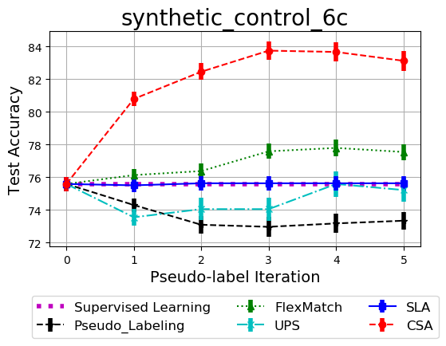
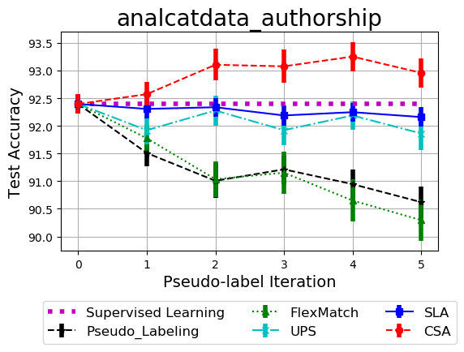
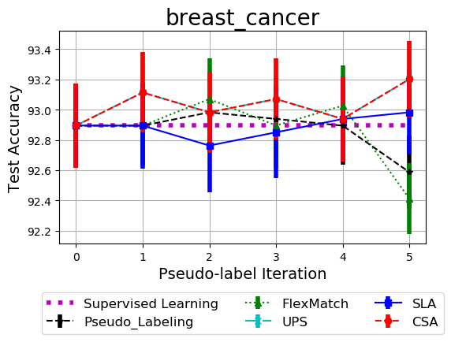
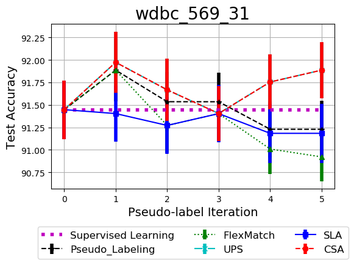

<div align="center">


# Confident Sinkhorn Allocation for Pseudo-Labeling

  **[Installations](#Installations)**
| **[Reproduce Experiments](#experiments)**
| **[Make Plot](#plot)**
| **[Public Datasets](#datasets)**
| **[References](#References)**

[](https://arxiv.org/pdf/2206.05880.pdf)


We propose a semi-supervised learning method for tabular data that does not
require any domain-specific assumption. The method we propose is based on pseudo-labeling of a set of unlabeled data using Confident Sinkhorn Allocation (CSA). Our method is theoretically
driven by the role of uncertainty in robust label assignment in SSL. CSA will assign labels to only the
data samples with high confidence scores using Sinkhorn’s algorithm. By learning the label
assignment with optimal transport, CSA eliminates the need to predefine the heuristic thresholds
used in existing pseudo-labeling methods, which can be greedy. The proposed CSA is applicable
to any data domain, and could be used in concert with consistency-based approaches, but is
particularly useful for tabular data where pretext tasks and data augmentation are not applicable.

</div>

## Installations
```
pip install -r requirements.txt
```
or
```
!pip install git+https://github.com/ntienvu/confident_sinkhorn_allocation
```
## Packages
```
* colorama==0.4.5
* cycler==0.11.0
* fonttools==4.33.3
* joblib==1.1.0
* kiwisolver==1.4.3
* matplotlib==3.5.2
* numpy==1.23.0
* packaging==21.3
* pandas==1.4.3
* Pillow==9.2.0
* pyparsing==3.0.9
* python-dateutil==2.8.2
* pytz==2022.1
* scikit-learn==1.1.1
* scipy==1.8.1
* six==1.16.0
* threadpoolctl==3.1.0
* tqdm==4.64.0
* xgboost==1.6.1
```

## <a id="experiments" /> Run and reproduce the experiments

* Reproduce the experiments [](https://colab.research.google.com/drive/1Miq659eCRpbH0qzLjGWxbSbhZQmwx_lM#scrollTo=tubZzNQc3EFg)


* Demo Confident Sinkhorn Allocation for Multiclassification [](https://colab.research.google.com/github/ntienvu/confident_sinkhorn_allocation/blob/master/demo_ConfidentSinkhornAllocation.ipynb)


* Demo Confident Sinkhorn Allocation for Multilabel [](https://colab.research.google.com/drive/1z9_ijDdqHNqNah6olqpMUkh8F15kpu5G#scrollTo=j-JijnqQbdmC)

### Run single experiment. The result pickle file will be stored in --save_dir

* run CSA
```
cd run_experiments
python run_csa.py --numIters 5 --numTrials 5 --numXGBs 10 --confidence_choice "ttest" --dataset_name "synthetic_control_6c" --save_dir "../results_output"
```
* run Pseudo labeling
```
cd run_experiments
python run_pseudo_labeling.py --numIters 5 --numTrials 5 --upper_threshold 0.8 --dataset_name "synthetic_control_6c" --save_dir "../results_output"
```
* run FlexMatch
```
cd run_experiments
python run_flexmatch.py --numIters 5 --numTrials 5 --upper_threshold 0.8 --dataset_name "synthetic_control_6c" --save_dir "../results_output"
```
* run UPS
```
cd run_experiments
python run_ups.py --numIters 5 --numTrials 5 --numXGBs 10 --upper_threshold 0.8 --lower_threshold 0.2 --dataset_name "synthetic_control_6c" --save_dir "../results_output"
```
* run SLA
```
cd run_experiments
python run_sla.py --numIters 5 --numTrials 5 --numXGBs 10 --confidence_choice "None" --dataset_name "synthetic_control_6c" --save_dir "../results_output"
```
# <a id="plot" /> Plot results

> Please specify the following parameters. These parameters will link to the correct files in your result folders
```
* save_dir = 'results_output' # path to the folder store the results 
* out_file='' # change this if you have set it when running the experiments 
* numTrials=20 # number of repeated trials
* numIters=5 # number of used pseudo-iterations
* dataset_name='madelon_no' # datasets
* list_algorithms=['Pseudo_Labeling','FlexMatch','UPS','CSA'] # list of algorithms to be plotted
```
> the following parameters to be used to load the correct paths
```
* confidence='ttest' # only used for CSA 
* upper_threshold=0.8 # only used for Pseudo_Labeling,FlexMatch
* low_threshold=0.2 # only used for UPS
* num_XGB_models=10 # only used for CSA and UPS
```

```
python plot_results.py
```
 
 

 


## <a id="datasets" /> Datasets for multiclassification from UCI
> we can load all datasets for multiclassification with their datasetName as follows:
```
with open('all_data.pickle', 'rb') as handle:
    [all_data, datasetName_list] = pickle.load(handle)
```
> List of all datasets
```
* segment_2310_20
* wdbc_569_31
* analcatdata_authorship
* synthetic_control_6c
* German-credit
* madelon_no
* agaricus-lepiota
* breast_cancer
* digits
```
## Datasets for multilabel classification from UCI
> we can load all datasets for multi-label classification with their datasetName as follows:
```
with open('all_data_multilabel.pickle', 'rb') as handle:
    [all_data, datasetName_list] = pickle.load(handle)
```
> List of all datasets
```
* yeast
* emotions
```
## References:
```
Vu Nguyen, Sachin Farfade, and Anton van den Hengel. "Confident Sinkhorn Allocation for Pseudo-Labeling." Workshop on Distribution-Free Uncertainty Quantification at ICML 2022
```
